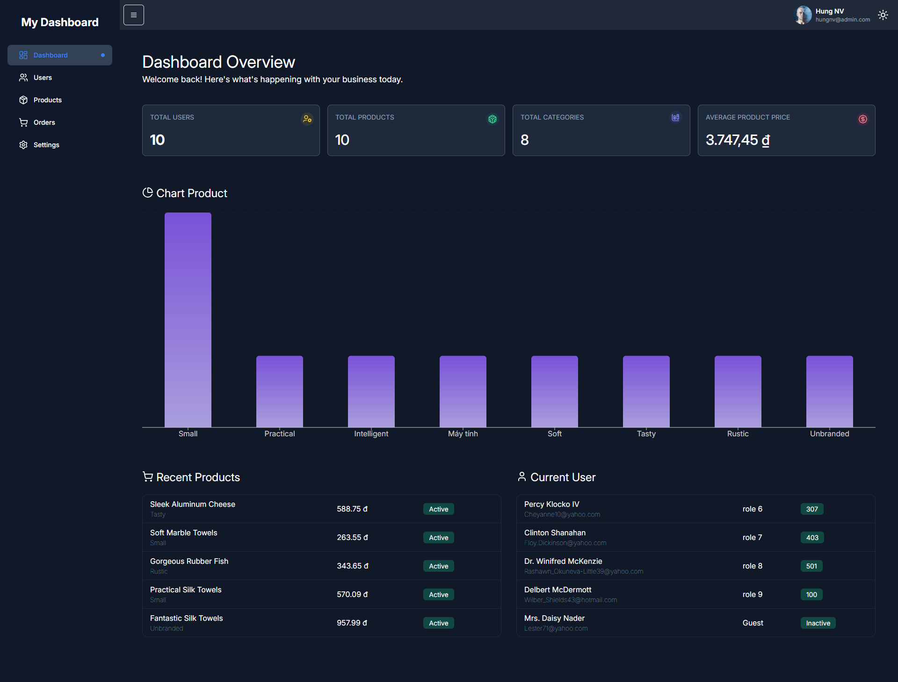

# React Dashboard

A responsive dashboard application built with React and TypeScript.

This project is a practical React project focused on building a dashboard with REST API integration, CRUD operations, server-side pagination, search, filtering, form validation, and data visualization.

## 🚀 Live Demo

[View Live Demo](https://react-dashboard-six-gold.vercel.app/)

## 📸 Screenshots

### Dashboard



### User Management


### Product Management


## 🛠️ Tech Stack

* React 18
* TypeScript
* Vite
* React Router
* Tailwind CSS
* Axios
* Recharts
* React Icons
* MockAPI

## ✨ Features

### Dashboard

* Display total users
* Display total products
* Display total categories
* Display total product value
* Product statistics
* Data visualization with Recharts
* Recent products
* Recent users

### User Management

* Get users from REST API
* Create user
* Update user
* Delete user
* Server-side pagination
* Server-side search
* Server-side filtering by role and status
* Form validation
* Loading state
* Error handling
* Empty state

### Product Management

* Get products from REST API
* Create product
* Update product
* Delete product
* Pagination
* Search
* Filter by category
* Sort products
* Loading state
* Error handling
* Empty state

## 🔌 API

This project uses MockAPI as the backend REST API.

### Users

```text
GET    /users
POST   /users
PUT    /users/:id
DELETE /users/:id
```

### Products

```text
GET    /products
POST   /products
PUT    /products/:id
DELETE /products/:id
```

## 📂 Project Structure

```text
src/
├── api/
│   └── axiosClient.ts
│
├── components/
│   ├── dashboard/
│   ├── users/
│   └── products/
│
├── constants/
├── layouts/
├── pages/
│   ├── Dashboard/
│   ├── Users/
│   └── Products/
│
├── services/
│   ├── userApi.ts
│   └── productApi.ts
│
├── types/
└── App.tsx
```

## 💻 Getting Started

### 1. Clone the repository

```bash
git clone YOUR_GITHUB_REPOSITORY_URL
```

### 2. Install dependencies

```bash
npm install
```

### 3. Start the development server

```bash
npm run dev
```

The application will run at:

```text
http://localhost:5173
```

### 4. Build for production

```bash
npm run build
```

## 🧠 What I Learned

Through this project, I practiced:

* Building reusable React components
* Managing state with `useState`
* Handling side effects with `useEffect`
* Working with TypeScript
* Building controlled forms
* Integrating REST APIs with Axios
* Implementing CRUD operations
* Implementing server-side pagination
* Implementing server-side search and filtering
* Handling loading, error, and empty states
* Building dashboard statistics
* Creating charts with Recharts
* Structuring a React application
* Working with Git and GitHub

## 🔮 Future Improvements

Planned improvements for the next version:

* TanStack Query for server-state management
* React Hook Form
* Zod validation
* Zustand for global state
* Authentication
* Custom Hooks
* Improved error handling
* Performance optimization
* Better responsive UI

## 👨‍💻 Author

Hung

Frontend Developer
